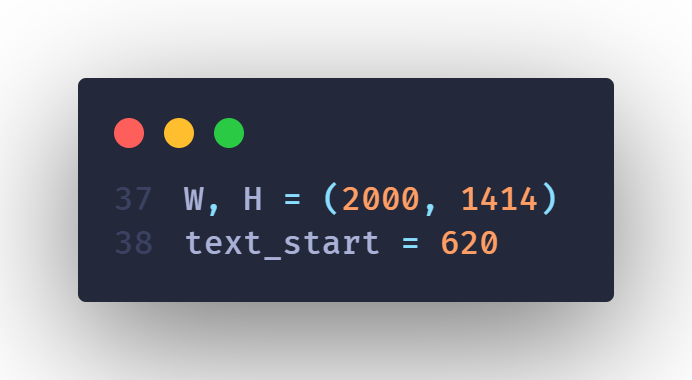
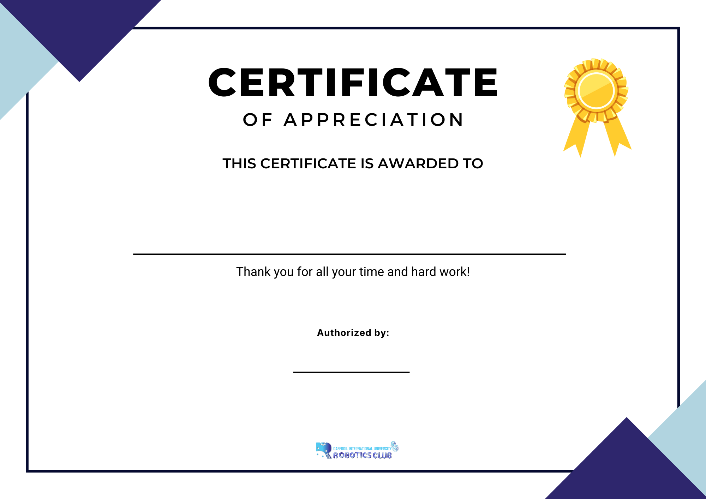

# Automated Certificate Generator
Automate your certificates with placing names.

## Introduction

I tried to automate my organization works when it comes for certificate naming, it was a very boring task for the members but now it's so easy and fast which can be done in one click.

This pyscript placed the text at the middle and align it in center which is not done by any other repos.

## Requirements
- Python 3
- numpy
- Pillow
- opencv-python


## How to use it?


**Step 00:** Install the libraries with pip if you don't have.

```
pip install numpy Pillow opencv-python

```

**Step 01:** Add the name on "names.txt" file.

**Step 02:** Choose a certificate template

**Step 03:** You can change W, h based on your certificates width, height and select the text starting height.



**Step 04:** Finally, execute the "run.py" script to get the outputs. You will get all of the certificates in "generated-certificates" folder.

```
python run.py

```


#### Template Certificate



#### Generated certificates


© 2022, Sajal Das